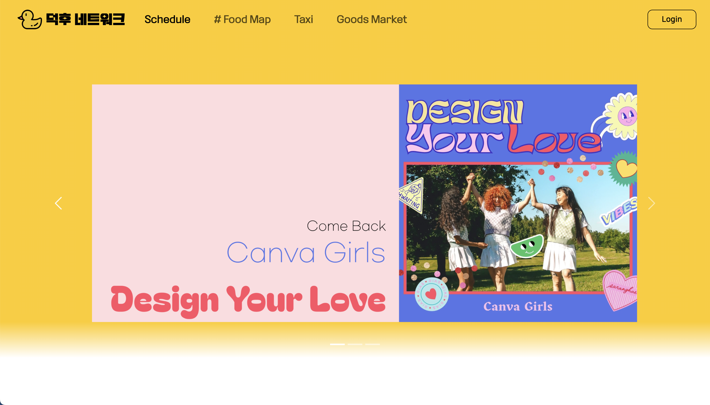
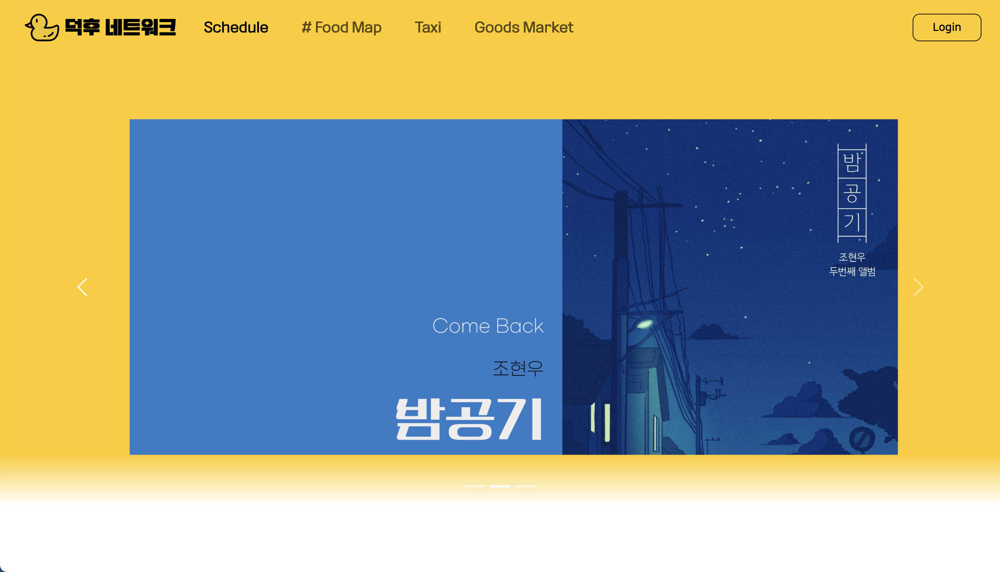
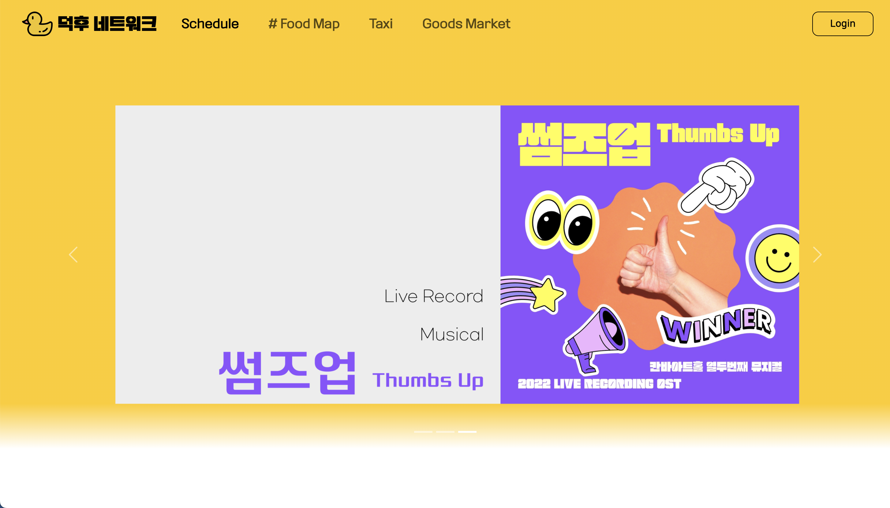
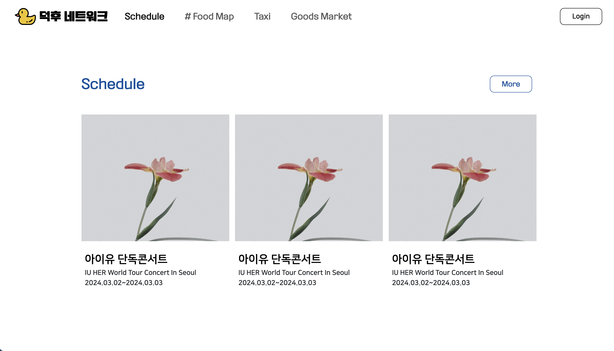
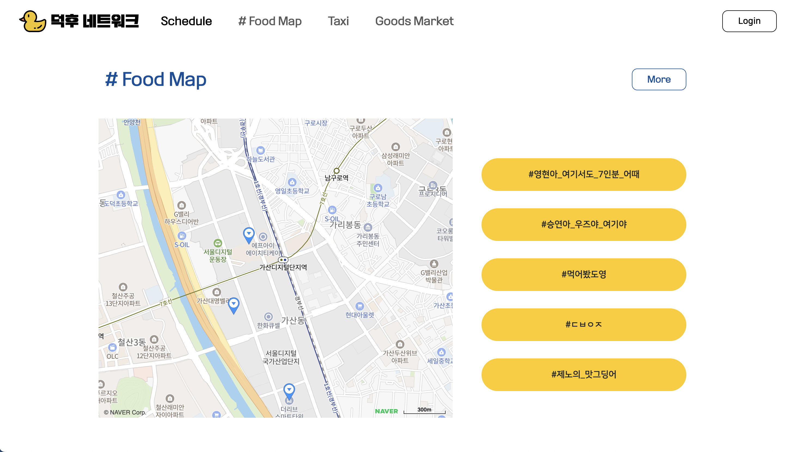
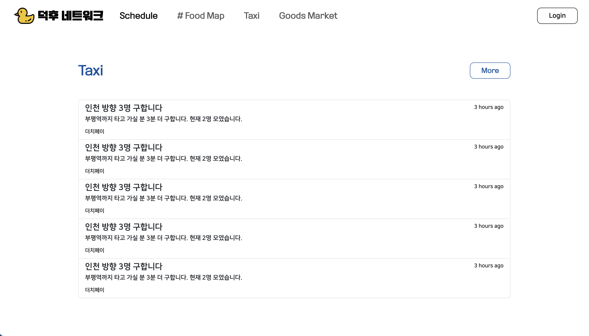
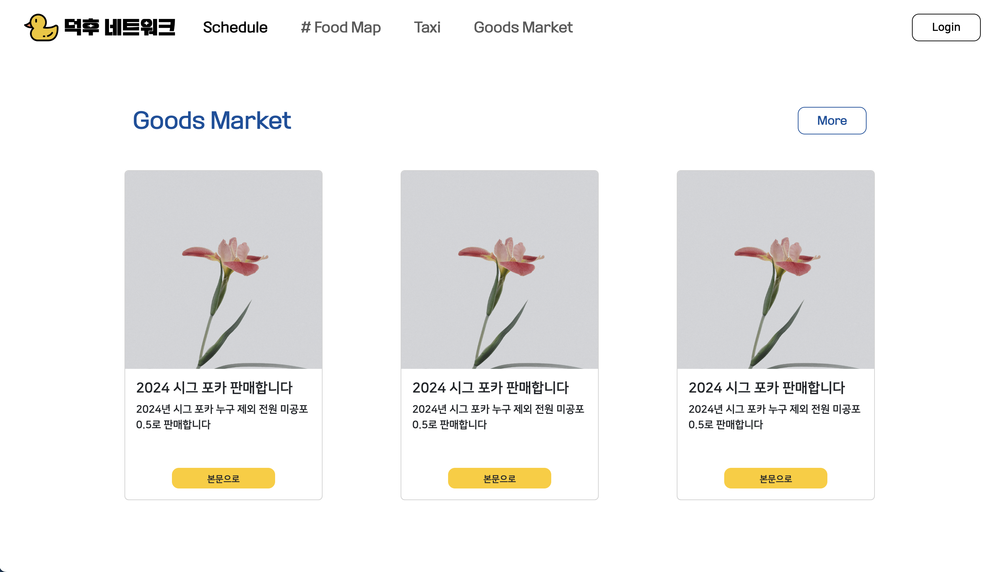
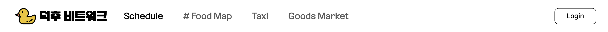
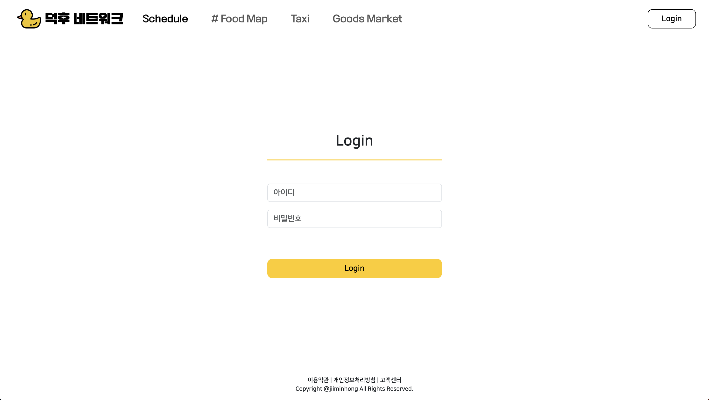

#  덕후 네트워크 (DuckHooNetwork)
취미에 몰입한 '덕후'들을 위한 사이트로, 취미 생활을 진행함에 있어 도움을 제공하고자 제작되었습니다.
     

## 목차
  - [개요](#개요)
  - [작업물 설명](#작업물-설명)
     

## 개요
- 프로젝트 이름 : 덕후 네트워크 (DuckHooNetwork)
- 프로젝트 기간 : 2024.03.12 ~ 2024.03.21
- 사용 언어 및 도구 : HTML, CSS, JavaScript, BootStrap, Figma, Naver Map's Enterprise API
- 멤버 : 홍지민
     

## 작업물 설명

||||
|:---:|:---:|:---:|
|메인 화면 (nav + header) 캐러셀1|메인 화면 (nav + header) 캐러셀2|메인 화면 (nav + header) 캐러셀3|
- 캐러셀을 이용하여 자동으로 목록이 넘어가도록 제작
- 양쪽 화살표와 아래쪽 버튼을 클릭하면 해당 페이지에 맞는 캐러셀로 이동
  

|||
|:---:|:---:|
|메인 화면 (main - schedule)|메인 화면 (main - # food map)|
- schedule 파트는 이미지와 제목에 링크 설정
- #food map 파트에서 지도는 naver api를 이용, 주요 맛집 핀 설정
  

|||
|:---:|:---:|
|메인 화면 (main - taxi)|메인 화면 (main - goods market)|
- taxi 파트는 목록 배치
- goods market 파트는 card 이용
  

||
|:---:|
|메인 화면 (main - nav1)|
||
|:---:|
|메인 화면 (main - nav2)|
||
|:---:|
|메인 화면 (main - footer)|
- nav는 header에서는 투명 상태, 일정 윈도우 사이즈 이하에서부터 배경색을 white로 변경
  

||
|:---:|
|로그인 화면 (login - nav, main, footer)|
- 버튼 클릭 시 메인 화면으로 복귀
     
